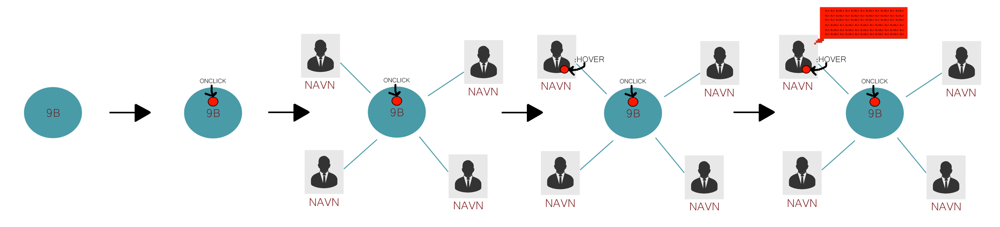
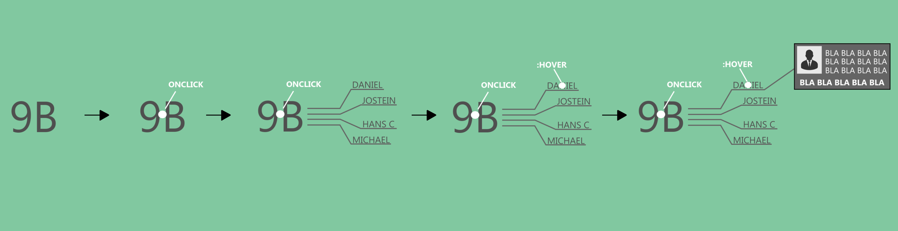
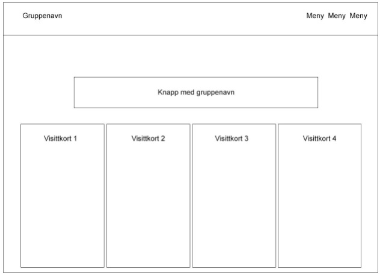
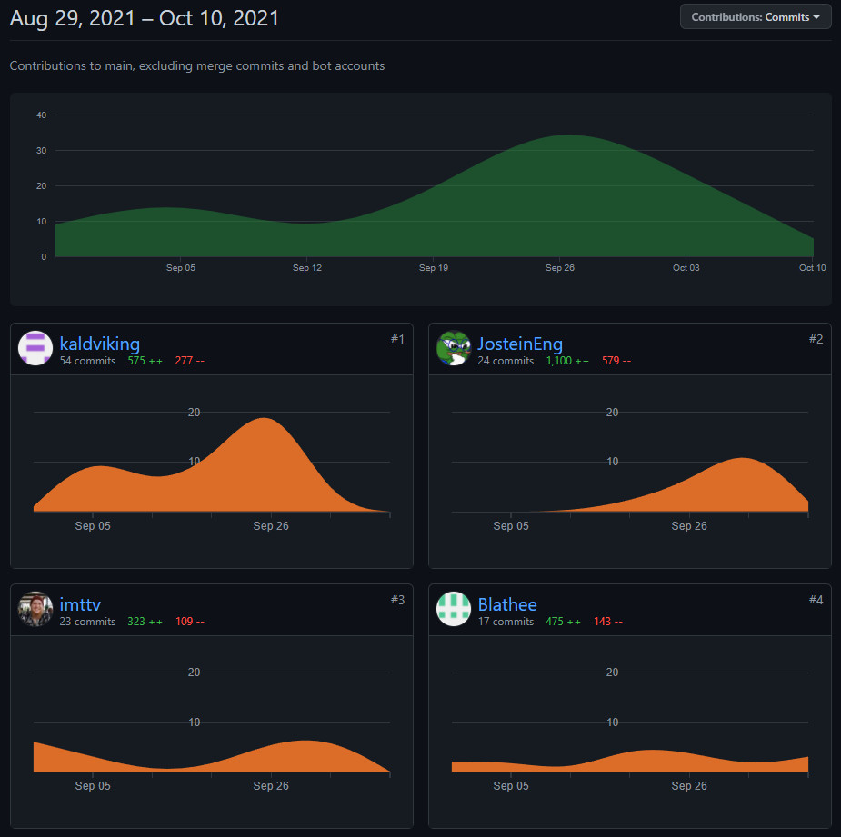
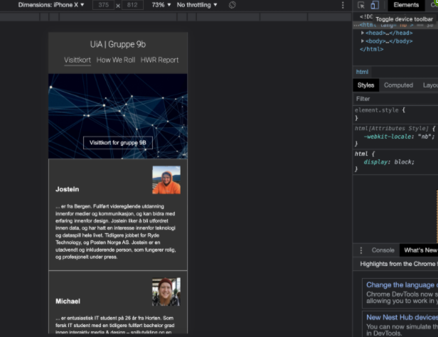
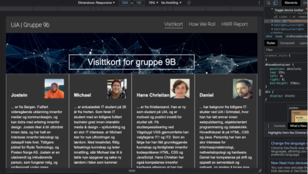
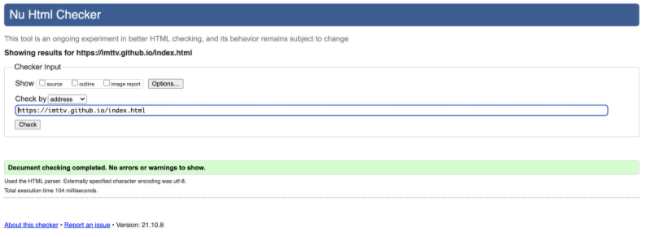
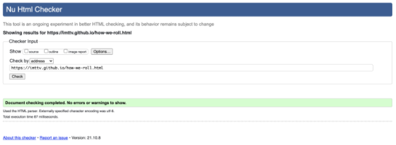
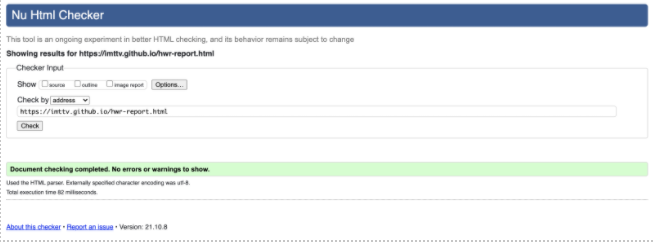

 # How we roll - Gruppe 9B
 #### Skrevet av gruppe 9B i emnet IS-114 ved UiA Kristiansand.

### Gruppe 9B | Main Repository
|Name|Mailadresse|Github|
|----|-----------|------|
|Daniel Gran|danieg13@uia.no|Kaldviking|
|Hans Christian Morka|hanscm@uia.no|Blathee|
|Jostein Engesæt|josteinen@uia.no|JosteinEng|
|Ivar Michael Tangeraas|ivarmt@uia.no|imttv|

### Viktige lenker for oppgaven 

Hovedrepository: https://github.com/imttv/imttv.github.io 

GitHub Page: https://imttv.github.io/

### Figurliste:
- Figur 1. Viser eksempel på Brukerhistorie 01.
- Figur 2. Viser eksempel Brukerhistorie 02.
- Figur 3. Viser eksempel for wireframe layout.
- Figur 4. Screenshot av contributors graf.
- Figur 5. Viser eksempel for hvordan layouten vises på en lavoppløst skjerm.
- Figur 6. Viser eksempel for hvordan layouten vises på en høyere oppløst skjerm.
- Figur 7. Viser at siden index.html valideres uten feil opp mot W3-validatoren.
- Figur 8. Viser at siden how-we-roll.html valideres uten feil opp mot W3-validatoren.
- Figur 9. Viser at siden hwr-report.html valideres uten feil opp mot W3-validatoren.

## Organisering og læringsutbytte
I arbeidet med oppgaven “How We Roll”, gikk vi først sammen i gruppen og delte oppgaven inn i mindre og mer håndterlige deloppgaver. Gruppen vår, 9B, består av 4 medlemmer med ulike erfaringsnivåer på koding med HTML, CSS og JavaScript. Fordi vi bare er 4 på vår gruppe, valgte vi å bruke tid på å gå gjennom kode og hjelpe hverandre der hvor det var behov. På den måten har vi forsøkt å sikre at alle på gruppen sitter på den samme kompetansen og forstår hva koden vi skriver gjør. For å oppnå dette, har vi ved flere anledninger satt oss ned sammen på et grupperom og skrevet linje for linje med kode. Linjene ble så forklart om hva slags funksjon de hadde. Ved å gjøre arbeidet på denne måten har vi brukt mye tid, men det fine er at vi har fått en oppfriskning og lært mye nytt mens vi har jobbet tett sammen.

Med deloppgavene foran oss, har vi fokusert på hva oppgaven etterspør, samtidig som vi har forsøkt å beskrive nokså detaljert hva vi har gjort og på hvilken måte vi har utført deloppgavene. Samtidig har vi lagt inn kommentarer i kildekoden til de tre dokumentene “index.html”, how-we-roll.html” og “hwr-report.html”, hvor vi beskriver i koden hva vi ønsker å oppnå med definisjonene, koden og stilingen av layout. 

## GitHub og brukerkontoer 
For å kunne ta i bruk GitHub for å løse oppgavene, sørget vi for at alle medlemmene i gruppen fikk satt opp egne brukerkontoer. Brukerkontoene ble så oppgradert til pro-status gjennom studentmedlemsskap i GitHub. Deretter valgte vi å lage et nytt prosjekt på en av brukerkontoene og et nytt repository, som ble vårt “hovedrepository”, som vi koblet opp mot GitHub Pages. De andre gruppemedlemmene ble deretter lagt til som contributors og fikk skrivetilgang til prosjektet. For at ikke alle skulle jobbe samtidig på main branch, lagde vi egne branches som vi jobbet på. Endringene vi foretok ble sammenslått med main branch etter at minst to av gruppemedlemmene hadde kvalitetssikret at koden var korrekt og samtidig for å luke ut konflikter i koden.

Oppgaven som omhandler visittkort, ble delt opp i kanban-bordet på GitHub. Hvert av medlemmene i gruppen fikk i oppgave å “ta ansvar” for sine egne visittkort og skrive en kortfattet tekst om seg selv. Teksten ble senere brukt i det ferdige resultatet av index.html som ligger på GitHub Pages (direktelenke: https://imttv.github.io/).  

## Wireframe, brukerhistorie og endelig design 
I utviklingsprosessen lagde vi flere utkast og skisser til designløsninger for hvordan et ferdig design kunne bli seende ut. Her fikk hele gruppen prøvd seg frem før vi endte opp med det endelige designet vi valgte å gå for. Kun små justeringer har blitt gjort i forhold til layout underveis. De forskjellige valgene vi foretok og responsivitet har vi beskrevet litt lengre ned i teksten.

Figurene under viser en visualisering av hvordan vi tenkte å utføre design av visittkortene. Målet med designet var å ha en knapp som viser navnet på gruppen, og ved et klikk så kommer visittkortet til gruppemedlemmene frem. I skissene valgte vi å vise informasjon om personene på hover, men i selve HWR oppgaven valgte vi å forenkle det ved å vise informasjonen sammen med personene uten hover.

#### Brukehistorie 1:

Figur 1

#### Brukerhistorie 2:

Figur 2

#### Wireframe:

Figur 3

### Programvare og Git Bash

For å gjøre det enklere å jobbe med koden, valgte vi å bruke IntelliJ som editor for å redigere og skrive kode i. For å laste ned prosjektet lokalt fra GitHub, valgte vi å bruke Git Bash. I Bash navigerte vi oss frem til mappen vi ønsket å lagre prosjektet i ved å bruke kommandoen “cd” etterfulgt av mappenavn. Vi brukte TAB-tasten på tastaturet for å autofullføre mappenavnene slik at de ble korrekt skrevet inn og for å spare tid. Kommandoen “pwd” ble så brukt for å vise hvilken mappe vi var i og for å bekrefte at vi hadde valgt riktig mappe.

Følgende streng ble brukt for å klone prosjektet ned til våre egne maskiner: “git clone <lenke>”. Lenken fant vi ved å gå til prosjektet på GitHub og trykke på knappen “Code”. Vi fikk da opp en URL som vi kopierte inn i Git Bash. Kommandoen ser slik ut: git clone https://github.com/imttv/imttv.github.io.git.

Med prosjektet lagret lokalt, åpnet vi IntelliJ og åpnet mappen som et prosjekt. Derfra kunne vi oppdatere prosjektet, og kjøre commits og push opp mot våre egne branches som vi la under main branch. Dette fungerte veldig bra, og vi hadde da hele tiden kontroll på koden og det vi hadde endret på eller lagt til i kildekoden.

## Gruppens “contributions” og “commits” i GitHub
For å synliggjøre at hele gruppen har deltatt i gruppeoppgaven og skrevet kode, har vi hentet ut en skjermdump (figur 1) fra GitHub under “../graphs/contributors”. Skjermdumpen viser en graf og statistikk over antall “commits” og hvor mange kodelinjer som er lagt til og tatt bort av hvert gruppemedlem.

 Figur 4

## Viktige valg i utviklingsprosessen
#### Styling med CSS:
I utgangspunktet ønsket vi å bruke et separat stilark for å gjøre koden mer oversiktlig og gjøre det enklere å redigere stiler. Dette er en etablert konvensjon som brukes når man utvikler nettsider (W3, 2021). Hensikten med å separere stiler og DOM-treet er å gjøre koden mer oversiktlig og lesbart for seg selv og andre som skal redigere koden. Dette er spesielt gjeldende når koden begynner å nå en viss størrelse.

Da vi tok for oss oppgaven, ble det stilt et krav fra faglærer om at all “styling” skulle foretas i hoveddokumentet. Vi forstår at årsaken er at det skal bli enklere å foreta den faglige vurderingen av arbeidet vårt og samtidig gjøre det enklere for elevene å teste ut forskjellige definisjoner ved å stile internt og inline.

Utfordringen vi møtte på var at all stylingen vi hadde gjort måtte repeteres i de andre HTML-filene. Det gjorde det mer tungvint å definere stiler. Vi måtte hele tiden sørge for å oppdatere de andre HTML-filene med endringen vi hadde utført på index.html. Dette kunne vi ha unngått dersom vi hadde brukt et eget stilark. Vi forstår at styling kan gjøres i head-elementet, som et eget stilark og direkte i HTML-elementer (inline-stilering). Et eksempel på sistnevnte er å definere stilingen til H1-elementet, og kan gjøres på følgende måte: <h1 style=”font-size: 20px;”></h1>.

Det er noen fordeler og bakdeler med å stilere inline. Tar vi for oss den viktigste fordelen, så er det at man kan angi en stil direkte i koden, også ved bruk av JavaScript. På den måten kan man for eksempel velge å skjule eller vise et element hvis man trykker på en knapp eller en boks. Den viktigste bakdelen, eller ulempen, er at stilen vil kun gjelde for akkurat det elementet man definerer en stil for, og vil ikke kunne brukes igjen senere i koden. Hvis vi foretar all styling inline, så vil dokumentet etter hvert bli veldig stort og komplekst. Det vil derfor bli vanskeligere å redigere og gjøre endringer på et senere tidspunkt.
#### Definisjon av språk og Unicode tegnkodesett:
Ettersom nettsiden i større grad skal vise innhold som er norskspråklig, har vi valgt å definere innholdet som “nb” i html-elementet. Når vi definerer “nb”, så forteller vi nettleseren at innholdet er skrevet i norsk bokmål. Videre har vi definert at tegnkodesettet skal være UTF-8 etter som det er en Unicode-standard som benyttes i alle moderne nettlesere (W3, 2021). Disse valgene vil ha en påvirkning for hvordan blant annet spesialtegnene “æ”, “ø” og “å” vil vises i nettlesere.
#### Mappestruktur i GitHub:
I GitHub har vi valgt å ha en konvensjonell mappestruktur. Med det mener vi at for eksempel bildefiler skal lagres i en egen mappe i stedet for å ligge blant html-filene. I vårt tilfelle heter bildemappen “media”. Dette har vi valgt å gjøre for at mappestrukturen skal mer oversiktlig og det vil gjøre det enklere å navigere seg frem til filer dersom det blir mange av dem.

## Responsivt design og layout
Vi har utviklet nettsiden på GitHub Pages for å være responsiv i forhold til ulike oppløsninger på tvers av enheter. Hensikten er å gjøre nettsiden like funksjonell på en datamaskin som på en smarttelefon eller nettbrett.

For å oppnå det har vi aktivt brukt inspiseringsverktøyet i nettleseren. Det har vi gjort på følgende måte ved å høyre-klikke i skjermvinduet og velge “Inspiser elementer” og trykt på “Toggle Device Toolbar”. Der fikk vi opp mål om hvor mange piksler telefoner og ulike skjermer har i bredde.

Ut ifra denne informasjonen har vi brukt CSS-standarden Media Query. I CSS definerte vi følgende: “@media only screen and (max-width: 375px) {}”.  Her forteller vi nettleseren at dersom bredden på skjermen er mindre enn eller lik 375 piksler, så skal en annen angitt stil være gjeldene. Ved å bruke Media Query kan vi sørge for at visittkortene vises ovenfor hverandre dersom oppløsningen på skjermen er for lav til å sidestille visittkortene (se eksempel i figur 5). Figur 6 viser hvordan nettsiden blir seende ut på en høyere oppløst skjerm.

 Figur 5

 Figur 6

## JavaScript, How-we-roll og HWR report 
Koden som lager Form-elementene i how-we-roll.html og dataene som vises i hwr-report.html er satt opp med hensikt for å vise et dynamisk innhold. Vi har valgt å gjøre det på denne måten ettersom vi ikke har kontroll på den eksterne serveren som dataene lagres på. Vi har mulighet til å fremvise dataene statisk på siden hwr-report.html dersom vi hadde hardkodet spørringen i HTML-dokumentet.

Vi er også kjent med at hvis dette hadde vært en nettside som vi hadde laget for en produksjon, så ville vi ikke ha overført data i såkalt “plain text” over HTTP, men heller valgt å overføre dataene kryptert via HTTPS og ved bruk av SSL-sertifikater. På den måten ville brukerdataen ha vært kryptert. Sensitiv informasjon ville dermed ikke kunne bli plukket opp i reisen fra nettleseren og frem til serveren og tilbake igjen. 

## Validering av HTML og CSS 
Vi har utført en valideringssjekk av vår nettside ved å benytte W3 Schools sitt valideringsverktøy (Lenke: https://validator.w3.org/nu/).  Grunnen til at vi har tatt i bruk valideringskontroll er for å få innblikk i feil som vi kan ha oversett mens vi har kodet. Vi gjør dette også for å sikre oss at nettsiden vår skal følge industristandarden for koding av HTML og CSS.

I figurene under kan man se hvordan “index.html”, how-we-roll.html og “hwr-report.html” valideres uten feiler eller advarsler.  

 Figur 7

 Figur 8

 Figur 9

|Litteraturliste:|
|----|
|JavaScript-kodesnutter: Forelesningsnotater og Janis Gaillis.|
|W3 Valideringsverktøy: https://validator.w3.org/|
|W3 Schools: Eksempler på kodeløsninger i HTML og CSS.|
|W3 Schools: UTF-8: https://www.w3schools.com/charsets/ref_html_utf8.asp (sjekket 2021/10/08).|
|W3 Schools. Eget stilark: https://www.w3schools.com/html/html_css.asp |
